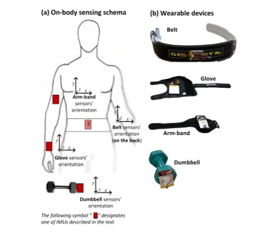

### Acknowledgement

This Course Project would not be possible without the generous contribution of the data set from the following research:

**Groupware@LES - Projects - Weight Lifting Exercises**  
Site: <http://groupware.les.inf.puc-rio.br/har>  
Working Paper: <http://groupware.les.inf.puc-rio.br/work.jsf?p1=11201>  
  
***Velloso, E.; Bulling, A.; Gellersen, H.; Ugulino, W.; Fuks, H. Qualitative Activity Recognition of Weight Lifting Exercises. Proceedings of 4th International Conference in Cooperation with SIGCHI (Augmented Human '13) . Stuttgart, Germany: ACM SIGCHI, 2013. ***
  
### Objective

The goal of your project is to predict the manner in which they did the exercise. This is the "classe" variable in the training set. You may use any of the other variables to predict with. 
  
You should create a report describing:
  
- How you built your model?
- How you used cross validation?
- What you think the expected out of sample error is?
- Why you made the choices you did?
  
You will also use your prediction model to predict 20 different test cases. 

### Abstract

The Random Forests approach is very adept in handing sensor data, and a 4-fold cross validation is done to achieve the best fit model in this project. The accuracy rate is of 99.08% and out-of-sample error of 0.92%.

```{r}

### The best fit model chosen in this project is to use all 52 original predictors from the 8 sensors attached on the experimental subject. 

# modelFit3 <- train(classe ~ ., method="rf", trControl = foldControl, data=crosstrain)

```

### Reading the Input data

```{r}

### modelFit3 is the best model selected for this project

```{r}

## Download the training and testing sets


# if(file.exists("./PProject")==0) {
#         
#         dir.create("./PProject")
# 
# } else {
#         
#         print("Folder is already downloaded!")
#         
# }
# 
# 
# if(file.exists("./PProject/pml-training.csv")==0) {
#         download.file("https://d396qusza40orc.cloudfront.net/predmachlearn/pml-training.csv", 
#                       destfile="./PProject/pml-training.csv", method= "auto")
#         
# } else {
#         
#         print("File is already downloaded!")
#         
# }
# 
# if(file.exists("./PProject/pml-testing.csv")==0) {
#         download.file("https://d396qusza40orc.cloudfront.net/predmachlearn/pml-testing.csv", 
#                       destfile="./PProject/pml-testing.csv", method= "auto")
#         
# } else {
#         
#         print("File is already downloaded!")
#         
# }

## Reads the Data

training <- read.csv("./PProject/pml-training.csv", na.strings=c("NA",""), header=TRUE)
origintest <- read.csv("./PProject/pml-testing.csv", na.strings=c("NA",""), header=TRUE)

```

### A Sensible Dataset?

One could not make sense of which covariates (predictors) to use without exploring what the covariates are. To go about this, I extracted certain elements from the working paper provided by the research team behind this data set.

Turns out, the names of the variables come from the equipments used for collecting the data! Following is the experimental setup to measure a single activity, Unilateral Dumbbell Biceps Curl:



*IMUs refer to the Razor inertial measurement units, which are the sensors used in this Research*

Sensor data is complicated. This is a brief summary:  
  
"We can see that the data derived from the belt may be important. This is characteristic of a full motion on conducting the activity, which may stress upon the abdominal muscles. Though, the experiment is only using a 1.25kg dumbbell, meaning that the intensiveness of the exercise may differ across different individuals, therefore variables related to the belt may not be accurate in prediction. The most direct predictors, however, may lie with the data collected from the dumbbell itself and from the biceps, because..."  
  
Complicated inter-relationship, isn't it?  

Put it this way. Sensors measure acceleration, gyroscopic and magnetic data. These variables are separate. It simply means, it is impossible to get data on all scales; one point of time, the sensor may pick up data on one variable, and loses the other variable because the sensor, is, a sensor. It simply cannot handle complex inter-related functions like humans do.  

Therefore, I will consider the data from all the 8 sensors (also referred as features in the working paper) used in this data set.  

### Prediction Study: Clean Data Set

Only the training data set will be read into R for analysis, as only did the "classe" variable exists in this data set. 

Before the data partitioning starts, I will remove the unnecessary variables. These unnecessary variables are defined as variables containing more than 70% of the NA placeholder values in the data set, and where they are considered near zero covariates (predictors).

```{r}
## Identifying variables to remove

require(caret)
nzv <- nearZeroVar(training, saveMetrics=TRUE)

### Near Zero Covariates are defined as not being unique, possibly because they contain a lot of zeros, or that they are binomial categories. In this case, I only removed the sensor variables that are mostly empty without data.

temp <- subset(training, select=-c(kurtosis_yaw_belt, skewness_yaw_belt, kurtosis_yaw_dumbbell, skewness_yaw_dumbbell, kurtosis_yaw_forearm, skewness_yaw_forearm))
temp2 <- subset(origintest, select=-c(kurtosis_yaw_belt, skewness_yaw_belt, kurtosis_yaw_dumbbell, skewness_yaw_dumbbell, kurtosis_yaw_forearm, skewness_yaw_forearm))

### Not all NAs can be defined through the Near Zero Covariates method. Further cleanup will be done on columns with NAs constituting 70% of the covariate (predictor). 

names_train <- names(temp)
NA_train <- as.character()

for (i in names_train) {

        if((sum(is.na(temp[,i])) >= 0.7*nrow(temp))) {
        
        temp3 <- i
        NA_train <- c(NA_train, temp3)
        
}
        
}

names_test <- names(temp2)
NA_test <- as.character()

for (i in names_test) {

        if((sum(is.na(temp2[,i])) >= 0.7*nrow(temp2))) {
        
        temp4 <- i
        NA_test <- c(NA_test, temp4)
        
}
        
        
}

sort_train <- temp[,!(names(temp) %in% NA_train)]
sort_test <- temp2[,!(names(temp2) %in% NA_test)]
        
### Cleanup the Workspace

rm(temp, temp2, temp3, temp4, nzv, i, NA_train, NA_test)


### Checking if there are near zero covariates in the clean set

nzv <- nearZeroVar(sort_train, saveMetrics=TRUE)
nzv

```

All together, excluding the "classe" variable, there are 52 covariates (predictors) available. You may find what the included variables represent, in the Codebook stored in the repository. All 52 covariates will be used in this experiment, as they represent important variables from the 8 sensors used for this data set.

### Prediction Study: Cross Validation & Algorithm Used
  
As the process can get long when passing more than 10000 observations through the training process, I shall do a 4-fold cross validation on the training set. This means, the main sample will be tested 4 times. Cross validation serves to increase accuracy of the model.
  
The new training and testing set will be created as ```crosstrain``` and ```testing```. The percentage attributed will be 60% and 40% respectively, for a medium sample size.
  
Intuitively, sensor data of a particular variable is independent at the point of reading, therefore random. The non-linear nature of sensor data is evident in this data set. Therefore, linear models will not be used. If you use the caret (Classification and Regression Techniques) package, it immediately identifies a linear model and generalized linear model as the wrong model type for classification.  

Principal Component Analysis will also not be used here, as every predictor represents a dimension of the sensor variable (e.g. x,y,z), which will not constitute to an accurate prediction if one dimension is missing. It is akin to taking a part of the sensor away, and still expecting the sensor to function properly.

3 separate prediction functions will be applied to each sub train and test set. modelFit 1, 2 and 3 will be created.
  
1) No pre-processing. The Classification Tree model will be applied on ```crosstrain```.
2) No pre-processing. The Linear Discriminant Analysis model will then be applied on ```crosstrain```. This assumes that the data can be explained by a probablistic approach using Bayes Theorem, and a function that characterises the data as a Gaussian distribution of same covariances.
3) No pre-processing. The Random Forest model will be applied on ```crosstrain```. This prediction model is particularly useful in dealing with huge amounts of input variables. The idea behind Random Forest lies in:
  
        - Bootstrapping the sample
        - Splitting the variables into different groups, and bootstrapping these variables again
        - Multiple Decision Trees, and a voting cycle starts on which prediction is the best

```{r}

### K-Fold exists as an option in trainControl

set.seed(3000)
inTrain <- createDataPartition(y=sort_train$classe, p=0.60, list=F)
crosstrain <- sort_train[inTrain,]
testing <- sort_train[-inTrain,]
crosstrain <- crosstrain[,-c(1:7)]
testing <- testing[,-c(1:7)]

### Setting commands for 4-fold cross validation

foldControl <- trainControl(method="cv", number=4)

### Simulating the prediction, using Random Forests.

require(randomForest)
require(rpart)

set.seed(3001)
modelFit1 <- train(classe ~ ., method="rpart", trControl = foldControl, data=crosstrain)
set.seed(3001)
modelFit2 <- train(classe ~ ., method="lda", trControl = foldControl, data=crosstrain)
set.seed(3001)
modelFit3 <- train(classe ~ ., method="rf", trControl = foldControl, data=crosstrain)

```

### Evaluation

We shall go into evaluation of the specified 3 model fits. As a reminder of what the research strives to do, an extract is taken, as follows:
  
*Six young health participants were asked to perform one set of 10 repetitions of the Unilateral Dumbbell Biceps Curl in five different fashions: exactly according to the specification (Class A), throwing the elbows to the front (Class B), lifting the dumbbell only halfway (Class C), lowering the dumbbell only halfway (Class D) and throwing the hips to the front (Class E).*
  
***1st Method: Classification Tree***

```{r}

### Classification Tree

require(rattle)
require(rpart.plot)
fancyRpartPlot(modelFit1$finalModel)

```

The results from the final model in this simulation gives little credibility, with the highest probability of up to only 30% predicting that a particular range of reading will lead to a person conducting an action of class C.

Lets do a prediction using modelFit1.

```{r}

predictor1 <- predict(modelFit1, newdata = testing[,-53])
confusionMatrix(testing$classe, predictor1)

```

As from the confusion matrix, an accuracy of only 51.47%, which is not satisfactory. Therefore, prediction with Classification Tree Models will be dropped.  

***2nd Method: Linear Discriminant Analysis***

```{r}

modelFit2

```

We can see that the accuracy of the fit lies on 70.1%. Let's do a prediction with this model.

```{r}

predictor2 <- predict(modelFit2, newdata=testing[,-53])
confusionMatrix(testing$classe, predictor2)

```

The accuracy, in this case, is 70.18%. It is still not satisfactory, therefore we will not go with the Linear Discriminant Analysis Model as the prediction function.

***3rd Method: Random Forests***

```{r}

modelFit3

```

Accuracy is the highest, at 98.9%, when 2 random sampled variables are used at each split in the random forest approach. No further tuning is done to the "mtry" parameter as it is obvious from the table that the higher "mtry" gets, the lower the accuracy goes. We shall do a prediction with this approach:

```{r}

predictor3 <- predict(modelFit3, newdata=testing[,-53])
confusionMatrix(testing$classe, predictor3)

```

Overall accuracy is of 99.08%. Therefore, we will go with the Random Forest Prediction Model. The out-of-sample error is 0.92%.

### Best Prediction Model: Random Forests

We now know that Random Forests is indeed a good approach in getting the accuracy we desire. Now, I shall apply this to the original test set, ```sort_test```. 

The prediction results are as follows:

```{r}

### Applying the best model fit to the original testing data, sort_test

set.seed(3001)
sort_test2 <- sort_test[,-c(1:7)]
predictor0 <- predict(modelFit3, newdata=sort_test2[,-53])
predictor0 <- as.character(predictor0)
print(predictor0)

```
